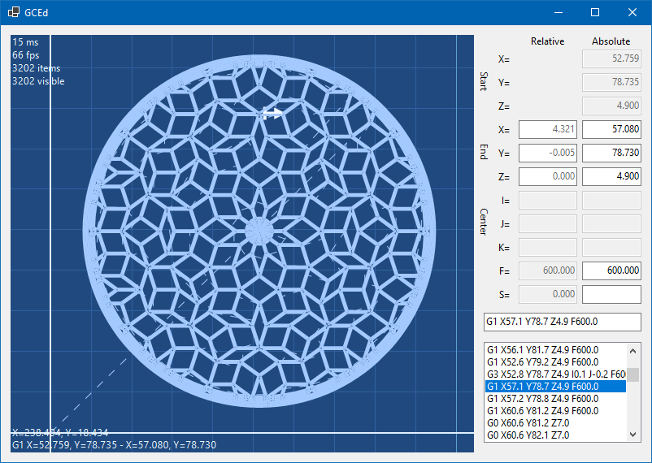
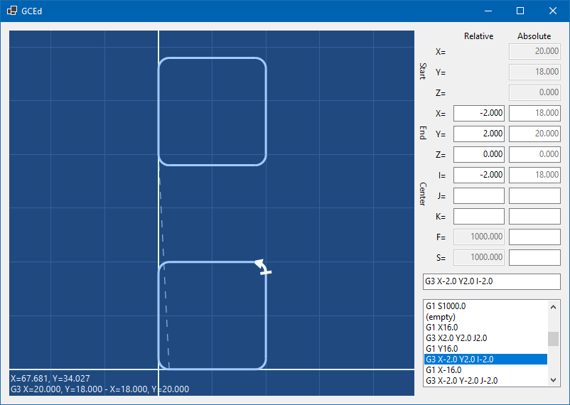

# GCEd

GCEd is a simple, 2.5D visual G-Code editor, with a focus on engraving and cutting operations.

# Features
 * Import G-Code from existing projects, including machine-specific dialects
 * Manual or visual program modifications
 * Conversion between relative and absolute positioning
 * Live preview of a machine path
 * Background image import for manual tracing
 * Vectorized text from any system font generation

# Requirements
 * Windows 7 SP1 or newer
 * Any Linux via Wine

# Roadmap

Not much development in this project is expected after initial release.

# License

This project is availabe under the MIT license. You can use, modify and distribute it for free as long as you acknowledge me as an author.